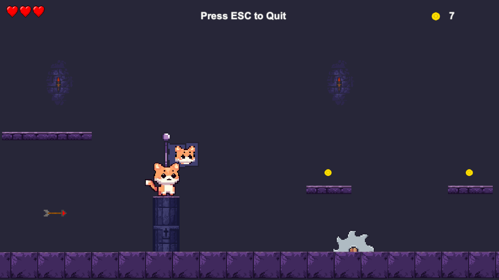

# Paws and Platforms
## 2D_Pixel_Platformer_Game_Demo

## Table of Contents
- [Overview](#overview)
- [How to Play](#how-to-play)
- [Features](#features)
  - [Version 1.0](#version-10)
  - [Version 1.2](#version-12)
- [Credits](#credits)

## Overview
This is a 2D pixel platformer game demo created to learn basic platformer mechanics and features. The game is built with Unity and includes multiple levels, player abilities, and various game systems.

  
  

  
  

## How to Play

[Play the game on Unity Play](https://play.unity.com/en/games/362b8ff6-2220-4905-ab0e-ef7fe33bcab3/paws-and-platforms)

- Movement: Use the arrow keys or A and D to move left and right.
- Jump: Press the Space key to jump. 
- Wall Jump: (If the skill is gained) Jump towards a wall and press left shift + direction you look arrow + up/down arrow
- Dash: (If the skill is gained) Press the left ctrl key to dash forward.
- Collect Coins: Collect them and increase your score.
- Collect Hearts: Collect them and increase your health..
- Checkpoints: Reach checkpoints to save your progress. You will respawn at the last checkpoint if you die. Except falling down.

## Features

### Version 1.0
- **Player Mechanics**:
  - **Double Jump**: Player can jump a second time while in the air.
  - **Coyote Time and Jump**: The player can jump off the platform immediately after falling.
  - **Horizontal Movement**: Smooth left and right movement.
  - **Wall Jump**: Players can jump off walls to reach higher areas.
  - **Player Animations**: Walking, jumping, hurt and die animations created using Aseprite.
 
- **Sounds**:
  - **Game Sounds**: Background music and sound effects for various in-game actions.
  - **Player Movement Sounds**: Sound effects for player actions like jumping, dying and taking damage.

- **Game Systems**:
  - **Health System**: Player have health points that decrease when taking damage and increase when collect hearth.
  - **Coin Collect System**: The player can collect coins to get score.
  - **Checkpoint System**: Players respawn at the last checkpoint they reached if they die.

- **Traps**:
  - **Spikes**: Instant damage upon contact.
  - **Arrow Trap**: Shoots arrows at intervals to hit the player.
  - **Fire Trap**: Emits flames that can damage the player when stepped on.
  - **Moving Chainsaw**: It moves back and forth, creating a danger for the player.

- **Menus**:
  - **Main Menu**: The starting screen where players can begin the game or exit.
  - **Game Over Menu**: Displayed when the player runs out of health. It contain main menu, restart and quit buttons.
  - **Finish Game Menu**: Shown when the player completes all levels. It countain buttons same as game over menu.

### Version 1.2
- **New Mechanics**:
  - **Moving Platforms**: Platforms that move horizontally or vertically, adding new challenges.
  - **Skill Gain**: Players can gain new abilities by collecting specific items:
    - **Wall Jump Skill**: Enables wall jumping.
    - **Dash Skill**: Allows players to dash forward quickly.
  - **Player Animations**: Dash.

- **New Content**:
  - **Level 2**: A new level with creative design and challenges.
  - **Level Transition**: Transition between levels when the player reaches the last checkpoint in the level.

 ### Version 1.3
- New and better player mechanics and animations
- Improved wall jump and dash
- Web browser play support

## Credits

This project uses various assets from the Unity Asset Store and other sources. Below are the credits and links to the assets used:

Sprites:
- The main character and animations were created by me using Aseprite.
- [2D Pixel art platformer pack for traps and collectible items](https://assetstore.unity.com/packages/2d/characters/pixel-adventure-1-155360)
- [2D Pixel art pack for level desing](https://assetstore.unity.com/packages/2d/characters/gothicvania-church-pack-147117)
  
Sound Effects:
- [Sound Effects Pack for background music](https://assetstore.unity.com/packages/audio/music/free-12-pixel-tracks-275547)
- [2D Game Sound Effects Pack](https://assetstore.unity.com/packages/audio/sound-fx/free-casual-game-sfx-pack-54116)
- Additional sounds for player movement and traps were sourced from FreeSound and other open-source platforms.
